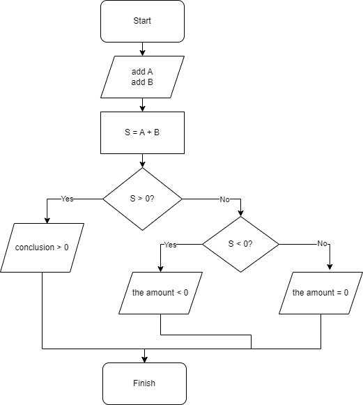

# Andrey_Oleynik_GB_3856
## Составил блок-схему проверки суммы двух чисел чисел A и B по отношению к 0.
---
### Последовательность, алгоритм решения:
- Пользователь вводит числа А и В.
- Создается переменная под названием S и присваиваивается сумма чисел A и B.
- Задается условие (S > 0?), при выполнение условия - (Вывод > 0),если условие не выполняется, то задется второе условие (S < 0?), если условие выполняется, то (сумма < 0), иначе (сумма = 0).
- Конец.
### Картинка блок схемы:

